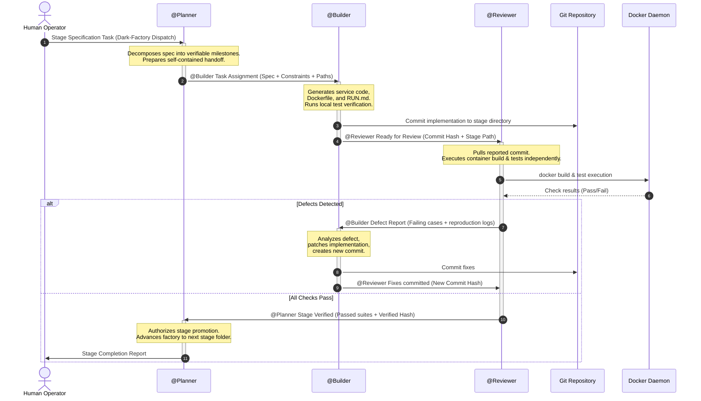

# Factory Technical Architecture

## 1. Architectural Overview

The Gemini Multi-Agent Factory is an autonomous software production pipeline designed to execute inside [BAND Desktop](https://band.ai) collaboration rooms. It organizes three specialized AI coding agents into a strict sequential development and verification loop:

---

## 2. Component Design & Roles

### 2.1 Coordination Tier (`factory.planner`)
- **Primary Agent**: GeminiPlanner (`@Planner`)
- **Model**: `gemini-3.8-flash`
- **Harness**: Google ADK (`band-sdk[google-adk]`)
- **Key Invariant**: **Zero Direct Code Modifications**. The Planner never edits code files. It operates strictly in the domain of requirements decomposition, dependency ordering, and milestone gatekeeping.

### 2.2 Implementation Tier (`factory.builder`)
- **Primary Agent**: GeminiBuilder (`@Builder`)
- **Model**: `gemini-3.8-flash`
- **Harness**: Google ADK (`band-sdk[google-adk]`)
- **Key Invariant**: **Zero Unilateral Self-Approval**. The Builder cannot advance stage folders or sign off on its own work. All work must be verified by the Reviewer.

### 2.3 Verification Tier (`factory.reviewer`)
- **Primary Agent**: GeminiReviewer (`@Reviewer`)
- **Model**: `gemini-3.8-flash-lite` or `gemini-3.8-flash`
- **Harness**: Google ADK (`band-sdk[google-adk]`)
- **Key Invariant**: **Zero Direct Code Patching**. The Reviewer never applies code fixes directly. If an error is detected, it must generate a reproduction log and return the defect to the Builder.

---

## 3. Communication & State Protocols

### 3.1 Direct Tagging Convention
All inter-agent communication uses explicit mentions (`@Planner`, `@Builder`, `@Reviewer`). Band Desktop translates these mentions into participant IDs within the room channel:
- `@[[participant-id]]` format in raw payloads
- Direct message routing ensures messages are visible to the targeted agent
- Room event logs record timestamps, message contents, and tool activations

### 3.2 Handoff Completeness
In accordance with official hackathon guidance, seats assume a **zero-shared-context** model:
- No seat relies on room scrollback or previous turns.
- Each handoff includes:
  - Full text of the relevant stage specification
  - Absolute path to the result repository
  - Strict resource constraints (ports, memory, network isolation)
  - Explicit list of verification commands

### 3.3 Atomic Git History Traceability
- Every milestone completion produces a Git commit in the stage folder.
- Reviewer verification cites the exact commit SHA being evaluated.
- Any defect fix results in an additional commit referencing the defect report.
- The resulting Git log forms an audit trail aligning with `room.json`.

---

## 4. Container & Runtime Specifications

Each stage directory produces an independent container complying with the hackathon execution envelope:

| Parameter | Constraint |
|---|---|
| Runtime Network | **Zero outbound access** (`--mode isolated`) |
| Inbound Port | Configurable via `-e PORT=<port>` (defaults to `8080`) |
| Mandatory Endpoint | `GET /health` responding `200 OK` within 60 seconds |
| Resource Limit | 2 vCPU, 2 GiB RAM |
| Ephemeral Storage | State need not persist across container restarts |
| Base Image | Self-contained; all runtime dependencies pre-packaged |
